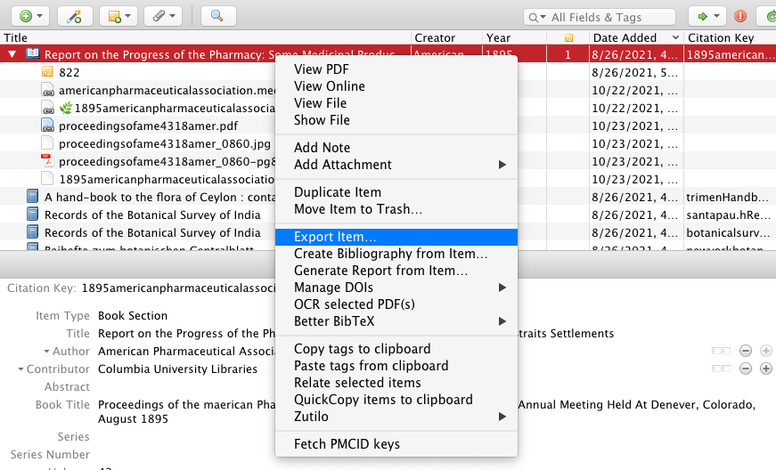
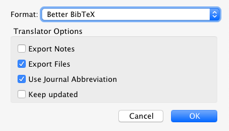

Information for people involved maintaining this website.

Consider this an incomplete work in progress. ([contrib/development information · Issue #10](https://github.com/ragynotes/ragynotes.github.io/issues/10))

## how the site runs

the actual site itself uses:

- `hugo`
  - base theme: [frjo/hugo-theme-zen: A fast and clean Hugo theme with css-grid and Hugo pipes support](https://github.com/frjo/hugo-theme-zen) 
  - customizations tracked in forked repo: [ragynotes/hugo-theme-zen](https://github.com/ragynotes/hugo-theme-zen/)
- `git`
- github.com
- github pages
- github issues

however other software is required to create the content:

- zotero
  - zotero extensions to be explicated later
- `ocrmypdf`
- ....

## set up local development environment

clone repo to local machine

```sh
git clone https://github.com/ragynotes/ragynotes.github.io.git
```

### differences between fresh clone and my local environment

- currently this does not include submodule for the theme so site will not build correctly ([add zen theme as submodule · Issue #11](https://github.com/ragynotes/ragynotes.github.io/issues/11))
- all `pdf`s have been added to `.gitignore` to prevent file size issues; this will have to be addressed properly later on ([large files (pdfs) · Issue #12](https://github.com/ragynotes/ragynotes.github.io/issues/12))
- I have not yet completed information on how to mirror the zotero set up in such a way that anyone but myself can really do this ([create consistent workflow for moving items from zotero to hugo · Issue #8](https://github.com/ragynotes/ragynotes.github.io/issues/8))

### hugo

TBAdded: install, configure

see [hugo documentation](https://gohugo.io/getting-started/usage/#draft-future-and-expired-content) for more options than the below

set up a live reloading server to run locally

```sh
hugo serve --buildDrafts
```


#### building site to deploy

delete previous `docs/` to avoid problems, then build site to the docs folder (from where it is published)

if you do not have `trash-cli` installed locally, change to `rm -r` or whatever you do to delete stuff 

```sh
trash docs && hugo
```

then push back to github

## finding and creating the content

- Instructive: [How to OCR or re OCR PDFs or create PDFs · Issue #9](https://github.com/ragynotes/ragynotes.github.io/issues/9)

## adding and editing content

### markdown

- do not open these markdown files in typora or other wyswyg editor as it screws them up.

### create page 

- use `hugo new` for generic

```bash
hugo new About/site-development.md
```

#### create page with special document template

uses archetypes ([docs](https://gohugo.io/content-management/archetypes/)) to create the entire folder required

```sh
hugo new --kind document content/Collected-Documents/document-title
```

- the folder "JunkPages" is never built with the site, so use for experiments [is this true?]
- archetype is defined in `ragynotes.github.io/archetypes/document`

#### obtaining files from zotero





this produced:

```sh
├── bib.bib
└── files
    ├── 792
    │   └── proceedingsofame4318amer_0860.jpg
    ├── 793
    │   └── proceedingsofame4318amer_0860-pg822.pdf
    └── 794
        └── 1895americanpharmaceuticalassociation.meeting.txt
```

remove files and rename them per template convention

### `YAML`

[How do you do block comments in YAML?](https://stackoverflow.com/questions/2276572/how-do-you-do-block-comments-in-yaml): has this [interesting approach](https://stackoverflow.com/a/50037498)

### images

see [instructions at theme repo](https://github.com/frjo/hugo-theme-zen#figure-and-img)

## templates

making changes to theme, must read: [add zen theme as submodule · Issue #11](https://github.com/ragynotes/ragynotes.github.io/issues/11)


