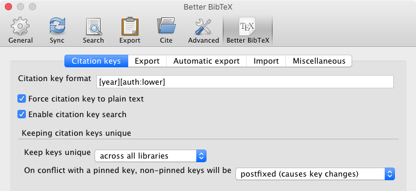
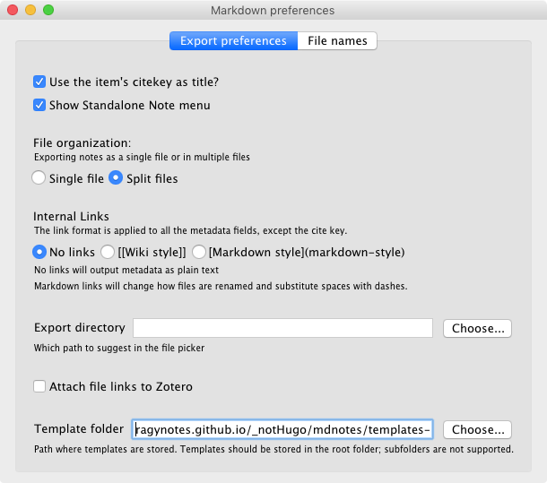
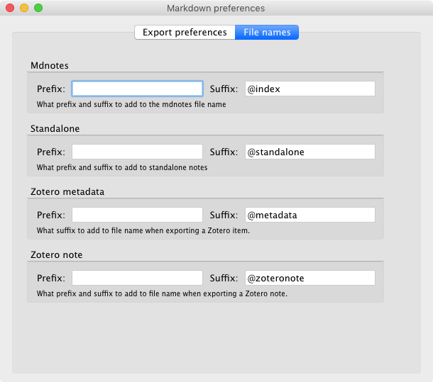
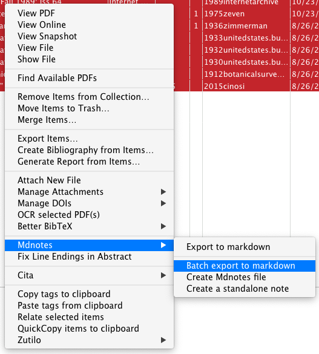
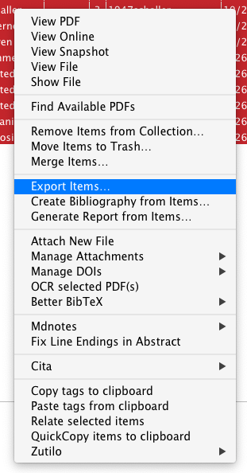
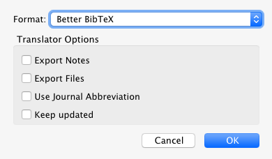

# making `mdnotes` work for task

See also [this issue where I commented in the `mdnotes` repo](https://github.com/argenos/zotero-mdnotes/issues/27#issuecomment-975496995) explaining what all this here does.

use "batch export to markdown"

## general

- need to include 2x line-breaks sequentially to ensure new line
- tried changing export filenames to include `/` in hopes of making subdirectories but instead the files seem to have not showed up? looked in both specified and default directories but not found. 
- There is also `mdnotes` documentation [here](https://argentinaos.com/zotero-mdnotes/docs/quick-start-guide), not sure how or it different.
- Tables might not work, see [Markdown Tables breaks when converting from Zotero Note · Issue #135 · argenos/zotero-mdnotes](https://github.com/argenos/zotero-mdnotes/issues/135)

### custom formatting for preferences in `about:config`

- It is adding the name of each feild before the information in the format: `Cite key: 1969blum`. This is documented with workarounds provided at: [Field formatting - zotero-mdnotes](https://argenos.gitbook.io/zotero-mdnotes/customization/formatting)
  - changes are made in Zotero hidden `about:config`. 
- I notice that line breaks are denoted with `\n`

#### `bullet`

try changing `extensions.mdnotes.bullet`:

```json
*
```

to

```json

```

ok, that help. not enough though.

#### `title`

try changing `extensions.mdnotes.placeholder.title`:

```json
{"content":"# {{field_contents}}", "field_contents": "{{content}}", "link_style": "no-links"}
```

to

```json
{"content":"{{field_contents}}", "field_contents": "{{content}}", "link_style": "no-links"}
```

perfect! for the title. now what about the rest?

#### ⚠️ `url`

`extensions.mdnotes.placeholder.url` to (added `link_style` component):

```json
{"content":"{{field_contents}}", "field_contents": "{{content}}", "link_style": "no-links"}
```

- adding `link_style` didn't work so instead try changing value in preferences dialogue and change value to:

```json
{"content":"{{field_contents}}", "field_contents": "{{content}}"}
```

⚠ changing the preference in the dialogue is only for "internal links" so this still turns to markdown. However not the end of the world so will proceed to fix the rest then return here later if needed. 

#### `author`

`extensions.mdnotes.placeholder.author` change to:

```json
{"content":"{{field_contents}}", "link_style": "none", "list_separator": ", "}
```

perfect!

#### `citekey`

change `extensions.mdnotes.placeholder.citekey` to:

```json
{"content":"{{field_contents}}", "field_contents": "{{content}}", "link_style": "no-links"}
```

perfect! 

#### `abstractNote`

`extensions.mdnotes.placeholder.abstractNote` change to:

```json
{"content":"{{field_contents}}", "field_contents": "{{content}}", "link_style": "no-links", "list_separator": ", "}
```

looks good! might consider changing `"list_separator"` to `/n/n` or making the whole thing into a list or blockquote. but will leave that to the future.  

#### library links

`extensions.mdnotes.placeholder.cloudLibrary`, `extensions.mdnotes.placeholder.localLibrary`

```json
{"content":"{{field_contents}}"}
```

#### ⚠️`DOI`

`extensions.mdnotes.placeholder.DOI` change to:

```json
{"content":"{{field_contents}}", "field_contents": "{{content}}", "link_style": "no-links"}
```

⚠ result is: `[10/gb85nb](https://doi.org/10/gb85nb)` so still has link. May need to investigate further in the future but for now, leave. 

####  `tags`

`extensions.mdnotes.placeholder.tags` change to:

```json
{"content":"{{field_contents}}", "field_contents": "{{content}}", "link_style": "no-links", "list_separator": "\n - ", "remove_spaces": "true"}
```

perfect! have used what I believe to be the correct formatting for `yaml` which is one tag per line (I prefer this to comma delineated lists). [relevant hugo documentation](https://gohugo.io/content-management/taxonomies/#order-taxonomies)

* need to keep one tags default

```yaml
{"content":"tags: \n{{field_contents}}", "field_contents": " - {{content}}", "link_style": "no-links", "list_separator": "\n", "remove_spaces": "true"}
```

#### ⚠️ `collections`

`extensions.mdnotes.placeholder.collections` change to:

```json
{"content":"{{field_contents}}", "field_contents": "{{content}}", "link_style": "no-links", "list_separator": "\n - ", "remove_spaces": "true"}
```

⚠ There are no items with >1 collection so this is not properly tested. I am also not sure if or how I will use this. Have defaulted to formatting same as `tags`  on the assumption that they would go in the `yaml` front matter. 

#### `related` items

`extensions.mdnotes.placeholder.related` change to

```json
{"content":"{{field_contents}}", "link_style": "no-links", "list_separator": ", "}
```

#### ⚠️ `notes`

`extensions.mdnotes.placeholder.notes` change to:

```json
{"content":"{{field_contents}}", "field_contents": "{{content}}", "link_style": "no-links", "list_separator": "\n- "}
```

not sure how this one will work out... need to learn how the different parts of extension work together. 

⚠ changed`"link_style":` from ` "wiki"` to `"no-links"` but something else might be more appropriate... or let `hugo` handle it. 

#### ❌  `pdfAttachments`

`extensions.mdnotes.placeholder.pdfAttachments` change to:

```json
{"content":"{{bullet}} PDF Attachments\n\t- {{field_contents}}", "field_contents": "{{content}}", "list_separator": "\n\t- "}
```

❌ do not use: links to zotero URL. 

Also, need to figure out how to enable attachments other than PDF. 

#### new preference: `volume`

create preference `extensions.mdnotes.placeholder.volume` with value:

```json
{"content":"{{field_contents}}", "link_style": "none", "list_separator": ", "}
```

perfect!

#### new preference: `shortTitle`

create preference `extensions.mdnotes.placeholder.shortTitle` with value:

```json
{"content":"{{field_contents}}", "link_style": "none", "list_separator": ", "}
```

perfect!

#### new preference: `pages`

create preference `extensions.mdnotes.placeholder.pages` with value:

```json
{"content":"{{field_contents}}", "link_style": "none", "list_separator": ", "}
```

perfect!

#### new preference: `itemType`

create preference `extensions.mdnotes.placeholder.itemType` with value:

```json
{"content":"{{field_contents}}", "link_style": "itemType", "list_separator": ", "}
```

perfect!

#### new preference: `date`

create preference `extensions.mdnotes.placeholder.date` with value:

```json
{"content":"{{field_contents}}", "link_style": "itemType", "list_separator": ", "}
```

perfect!

#### new preference: `accessDate`

create preference `extensions.mdnotes.placeholder.accessDate` with value:

```json
{"content":"{{field_contents}}", "link_style": "itemType", "list_separator": ", "}
```

perfect!

#### new preference: `language`

create preference `extensions.mdnotes.placeholder.language` with value:

```json
{"content":"{{field_contents}}", "link_style": "itemType", "list_separator": ", "}
```

perfect!

#### new preference: `publicationTitle`

create preference `extensions.mdnotes.placeholder.publicationTitle` with value:

```json
{"content":"{{field_contents}}", "link_style": "itemType", "list_separator": ", "}
```

perfect!

#### new preference: `dateAdded`

create preference `extensions.mdnotes.placeholder.dateAdded` with value:

```json
{"content":"{{field_contents}}", "link_style": "itemType", "list_separator": ", "}
```

perfect!

#### new preference: `edition`

create preference `extensions.mdnotes.placeholder.edition` with value:

```json
{"content":"{{field_contents}}", "link_style": "itemType", "list_separator": ", "}
```

perfect!

#### new preference: `ISBN`

create preference `extensions.mdnotes.placeholder.ISBN` with value:

```json
{"content":"{{field_contents}}", "link_style": "itemType", "list_separator": ", "}
```

perfect!

#### new preference: `issue`

create preference `extensions.mdnotes.placeholder.issue` with value:

```json
{"content":"{{field_contents}}", "link_style": "itemType", "list_separator": ", "}
```

perfect!

#### new preference: `patent`

create preference `extensions.mdnotes.placeholder.patent` with value:

```json
{"content":"{{field_contents}}", "link_style": "itemType", "list_separator": ", "}
```

perfect!

#### new preference: `place`

create preference `extensions.mdnotes.placeholder.place` with value:

```json
{"content":"{{field_contents}}", "link_style": "itemType", "list_separator": ", "}
```

perfect!

#### new preference: `publisher`

create preference `extensions.mdnotes.placeholder.publisher` with value:

```json
{"content":"{{field_contents}}", "link_style": "itemType", "list_separator": ", "}
```

perfect!

#### new preference: `references`

create preference `extensions.mdnotes.placeholder.references` with value:

```json
{"content":"{{field_contents}}", "link_style": "itemType", "list_separator": ", "}
```

perfect!

#### new preference: `rights`

create preference `extensions.mdnotes.placeholder.rights` with value:

```json
{"content":"{{field_contents}}", "link_style": "itemType", "list_separator": ", "}
```

perfect!

#### new preference: `section`

create preference `extensions.mdnotes.placeholder.section` with value:

```json
{"content":"{{field_contents}}", "link_style": "itemType", "list_separator": ", "}
```

perfect!

#### ⚠️ new preference: `extra`

create preference `extensions.mdnotes.placeholder.extra` with value:

```json
{"content":"{{field_contents}}", "link_style": "itemType", "list_separator": ", "}
```

⚠ Looks OK but will probably need to be checked if used much. 

#### not done: new preference: `metadataFileName`

create preference `extensions.mdnotes.placeholder.metadataFileName` with value:

```json

```

#### not done: new preference: `mdnotesFileName`

create preference `extensions.mdnotes.placeholder.mdnotesFileName` with value:

```json

```


## fields

### most useful Zotero fields

descriptions can be found at [kb:item types and fields [Zotero Documentation]](https://www.zotero.org/support/kb/item_types_and_fields) and precise names at  [api.zotero.org/itemFields](https://api.zotero.org/itemFields?pprint=1). 

- `{{country}}`
- `{{DOI}}`

- `{{edition}}`
- `{{extra}}`
- `{{ISBN}}`

- `{{issue}}`

- `{{pages}}`

- `{{patent}}`

- `{{place}}`

- `{{publicationTitle}}`

- `{{publisher}}`
  - as link:  [San Francisco, Jossey-Bass](san-francisco,-jossey-bass)
- `{{references}}`

- `{{rights}}`

- `{{section}}`

- `{{shortTitle}}`

- `{{url}}`

- `{{volume}}`

### `mdnotes`  fields

Full list here: [Placeholders - zotero-mdnotes](https://argenos.gitbook.io/zotero-mdnotes/customization/placeholders#item-placeholders)

- `{{itemType}}` - The Zotero item type. 
  - Creates a link: [Book](book)
- `{{citekey}}` - The citekey (requires the Better Bibtex plugin).
- `{{tags}}` - The list of tags for the selected item.
- `{{dateAdded}}` - The date the item was added to your library.
- `{{notes}}` - A list of all the titles of all the child notes.

Probably note useful, but might be:

- `{{pdfAttachments}}` = A list of links to any PDF attachments. 
  - ❌ do not use: links to zotero URL. 

- `{{mdnotesFileName}}` - The name of the default mdnotes file (following the naming convention).

- `{{metadataFileName}}` - The name of the Zotero metadata file (following the naming convention).

- `{{collections}}` - A list of collections an item belongs to.

- `{{related}}` - A list of [related items](https://www.zotero.org/support/related).

  ## Better BibTeX citekey set up
  
  
  
  
  
  ## setup and run `mdnotes`
  
  `mdnotes` preferences
  
  







## rename/move files with Transnomino

- use recipe in repo (#02)
- will need manual cleanup

## BetterBibTex export



select format "Better BibTex" and NO options:



## chopping up the `.bib` file.

This chops up the large file named `Exported Items.bib` with the `@` indicating the beginning of each new file.  

```sh
awk '/^@/{close("file"f);f++}{print $0 > "file"f}' Exported\ Items.bib
```

source: [Split a file based on pattern in awk, grep, sed or perl](https://www.unix.com/shell-programming-and-scripting/70227-split-file-based-pattern-awk-grep-sed-perl.html)

It creates files numbered sequentially `file` (which is empty), `file1`, `file2`, etc. Need to rename the file with the cite key which is contained in the first line. 

This will rename *a* file to the contents of the first line. 

```sh
mv file2  $(head -1 file2).txt
```

source: [bash - Rename one file with the first line of the file's contents (not batch) - Stack Overflow](https://stackoverflow.com/questions/36025364/rename-one-file-with-the-first-line-of-the-files-contents-not-batch)

But I can't figure out how to make it in a loop (`--exec`, `| xargs`.. i dunno). So I will cheat:

see script `rename-to-first-line.sh` which proceeds thusly:

```sh
mv file1 $(head -1 file1).bib
mv file2 $(head -1 file2).bib
mv file3 $(head -1 file3).bib
mv file4 $(head -1 file4).bib
mv file5 $(head -1 file5).bib
```

Then use Transnomino recipe #3 to rename from the bibtex to the citekey. 

Now...?? I am tired of failing to figure out automation so I am going ot say, next step is manual sort. To be improved, maybe, a bit, some other time. 


