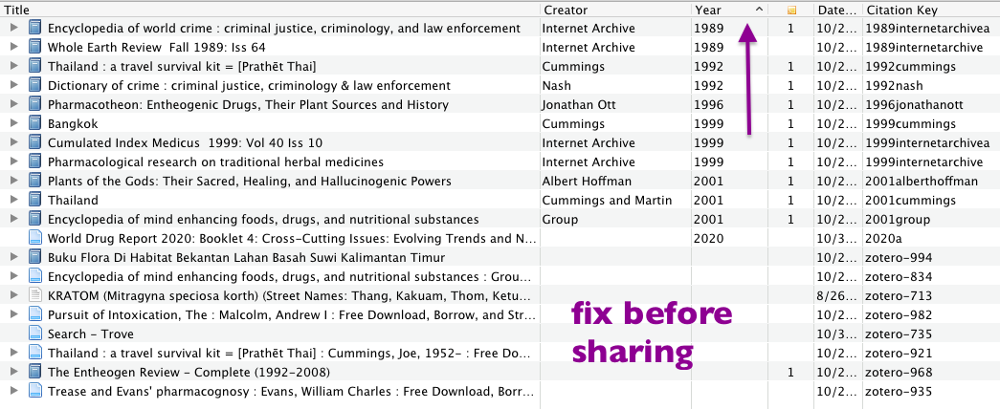
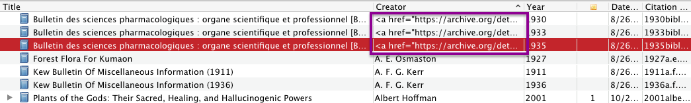
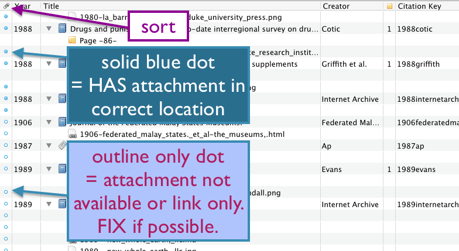
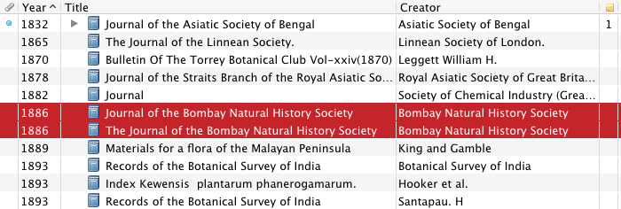
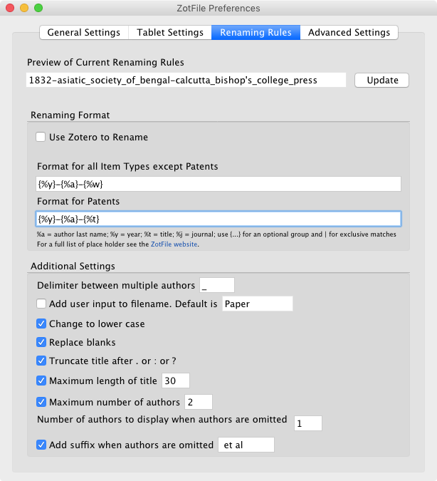
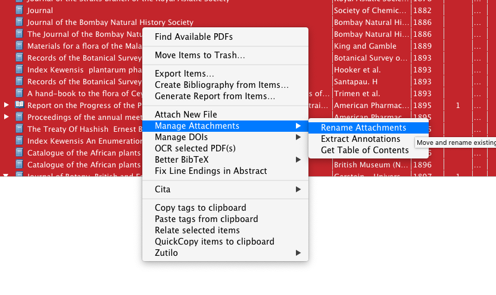

---
typora-copy-images-to:images
---

# Export from Zotero

Before making any changes to you zotero library, you may wish to [back it up](https://libguides.northwestern.edu/zotero/backups). 

### Create collection

While it's better to have subcollections to aid organization, for this task it's best to put all items in one collection together. Zotero does not remove the items from their original homes, so they will remain organized in  a useful fashion. So make a new collection and drag all the items you want to share into it. 

### Basic meta data tidy up

#### Every item should have a year and creator

Year and creator are required to post. Sort by year column to find all items missing date. Then do the same for "creator".

#### Check for junk

Check both the top and bottom of the list because blanks can appear at one end but junk at the other like in this example:

#### Check attachments exist

make sure you don't have broken or linked attachments:

#### Look for obvious duplicates

Sorting by year is a good way to find items that may be duplicates but for whom other meta data has been entered slightly differently. Here is an example:

If there is any doubt, look at the items, go to the URL where they are located, or otherwise investigate. They may in fact be distinct if for example there were multiple publications in the year. For example in the above example, *both* items were in fact mislabeled. By checking the URL I found they were from [2004](https://archive.org/details/journalofbomba1012004bomb) and [2010](https://archive.org/details/journalofbombayn1072bomb)! The journal has been in publication since 1886 hence the date. 

When reviewing duplicate items, have a look at the PDFs and select the one that has the best scan quality and legibility. If it's not obvious which one this is I usually consult the "added date" on the assumption that a more recent scan will be better. 

Use Zotero's "merge" feature to turn these into a single item.

Zotero does have a "find duplicates" feature but I don't like it because it returns a lot of false positives. Especially in my experience for items such as magazine and other periodicals, it gets confused between the multiple issues. There may be other cases where this can happen. So you must carefully investigate *each* potential result if you wish to use it! Not doing so could result in the erroneous deletion of meta data. Also there is no way to tell it to ignore a certain result, so every time you run it, all the same false positives will present themselves. The best workaround for this that I know of is to assign a tag such as "Not a duplicate!" however you must still *manually check* to see if such a tag exists before performing any action. 

### zotfile set up

Note: **do not set a custom location** in the "General Settings" tab. It will break everything and require manual work to fix...

In the preferences, for the first feild the text is `{%y}-{%a}-{%w}` and for patents, `{%y}-{%a}-{%t}`. Everything else like this:

Then go into your collection where all items are located and "Select All". Right click on the items `Manage Attachments` > `Rename Attachments` like so:

